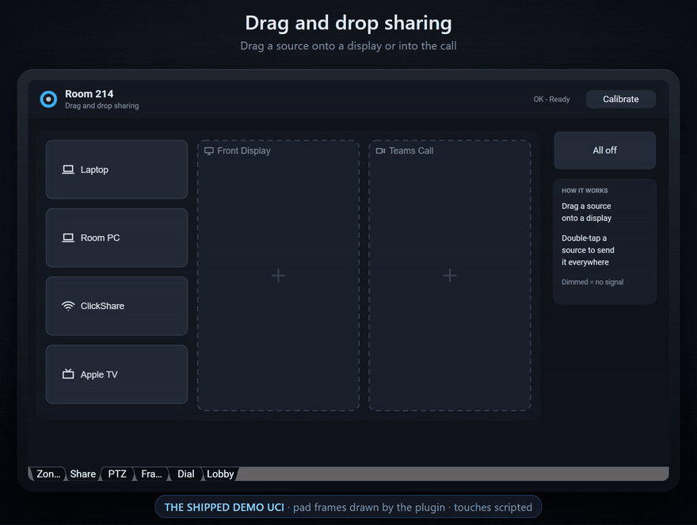
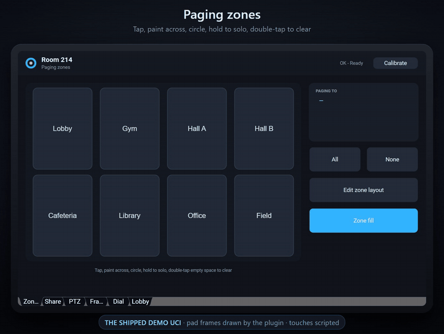
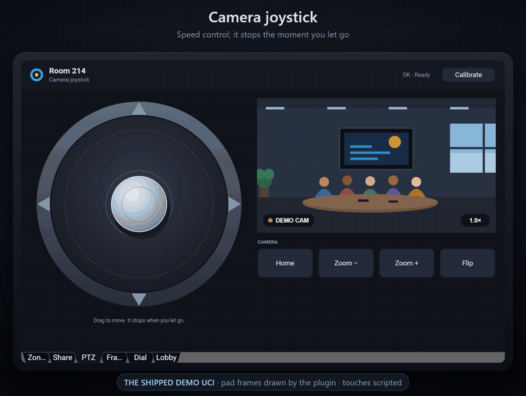
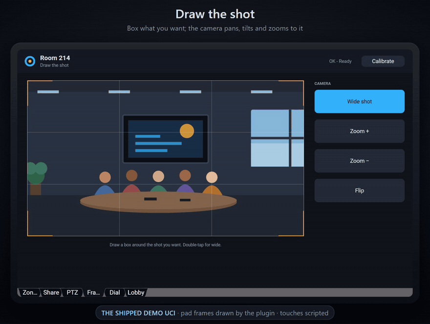
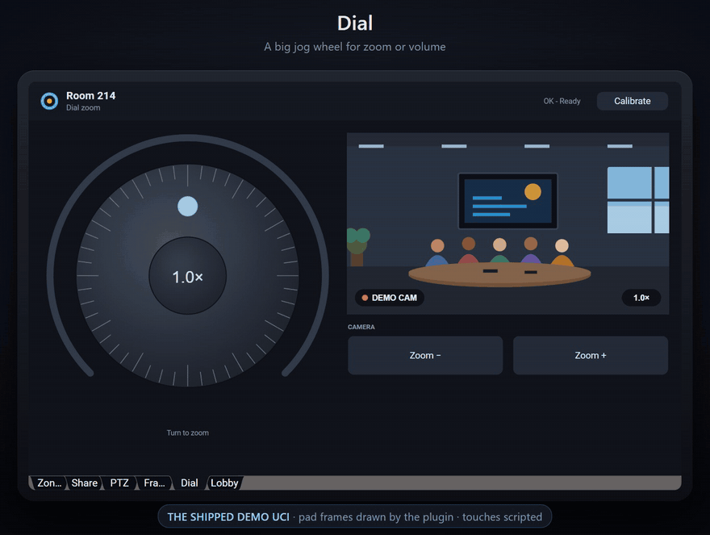
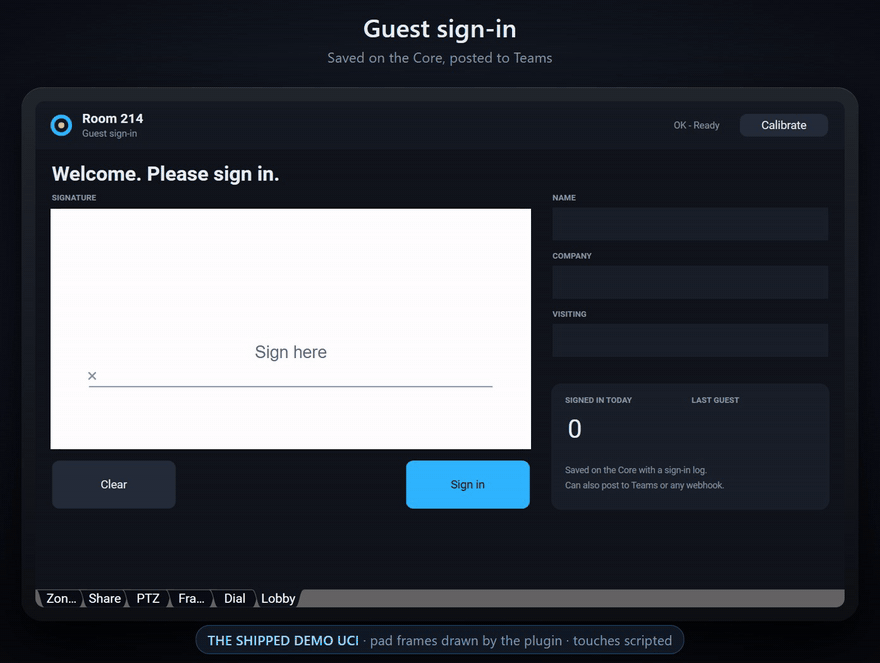
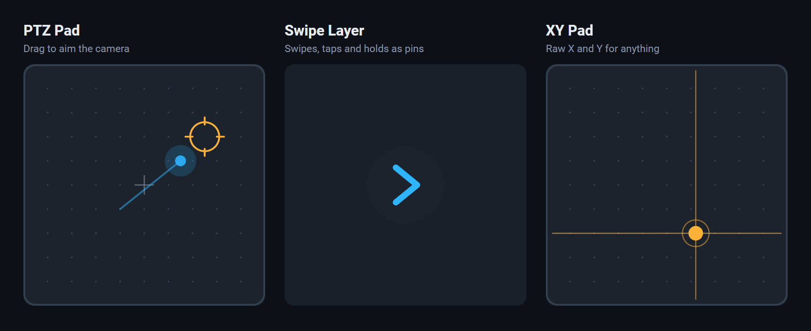

  

<h1 align="center">Gesture Pad</h1>

  <b>Real touch gestures on any Q-SYS UCI.</b> 
  Drag, paint, lasso, hold, swipe and dial. No extra hardware: it's one plugin.

  <a href="https://github.com/1o1tm/Gesture-Pad/releases/latest"><b>Download 0.9.7</b></a>
  &nbsp;&middot;&nbsp; <a href="docs/GUIDE.md">User guide</a>
  &nbsp;&middot;&nbsp; <a href="docs/PINS.md">Pins</a>
  &nbsp;&middot;&nbsp; <a href="CHANGELOG.md">Changelog</a>

  

Q-SYS UCIs have buttons and faders, but nothing that tells you where a finger is and what it's doing. Gesture Pad does. It reads the finger from a native Color Picker hidden under the page, works out the gesture, and draws its own interface on top. Nine modes in one plugin, and every mode's results are pins you can wire to anything.

## Nine modes

<table>
<tr>
<td width="50%" valign="top"> 
<b>Zone Select</b>: tap, paint across, circle or hold to solo zones on a map. Paging zones, divisible rooms, mic groups.</td>
<td width="50%" valign="top"> 
<b>Joystick</b>: speed control for a PTZ camera. It springs back, and the camera stops, when you let go.</td>
</tr>
<tr>
<td valign="top"> 
<b>Camera Framing</b>: draw a box around the next shot; the camera pans, tilts and zooms to it.</td>
<td valign="top"> 
<b>Dial</b>: a big jog wheel for zoom, volume or any knob, with a dead centre so it never jumps.</td>
</tr>
<tr>
<td valign="top"> 
<b>Sign-In</b>: a guest signs on the panel. Saved on the Core with a CSV log, and it can post to Teams or any webhook.</td>
<td valign="top"><b>Drag &amp; Drop</b> (at the top): drag sources onto displays or into a call, or tap a source and then a screen. Double-tap a source to send it to every screen. Up to 64 sources and 64 screens, on pages when they don't all fit.  
<b>And three more</b>, below: PTZ Pad aims a camera where you drag, Swipe Layer turns swipes, taps and holds into pins (swipe to change UCI pages, for instance), and XY Pad gives you raw X and Y for anything with two axes.</td>
</tr>
</table>

  

## How it works

There's no hidden API. The native Color Picker reports where you touch, live, while you drag. Gesture Pad hides a picker under a cover, reads those coordinates, works out the gesture (tap, double tap, hold, drag, swipe, lasso, rotation) and draws the interface on top with a Display that touches pass straight through. On a TSC, wiring the panel's **Touch Activity** pin into the plugin makes press and release exact.

## Get it

1. Download **Gesture-Pad.qplugx** from the [latest release](https://github.com/1o1tm/Gesture-Pad/releases/latest) and copy it to `Documents\QSC\Q-SYS Designer\Plugins`. Restart Designer: it's under **Plugins > User > Custom**.
2. The quickest look: open **Gesture-Pad-demo.qsys** from the same release, press F6 (Emulate) and open the UCI. Every page is already wired.
3. On a touch panel, start with **Gesture-Pad-single-pad.qsys**: one page, the joystick with a simulated camera.

The plugin is encrypted. Its source isn't published.

## Set it up in your own design

The short version (the [user guide](docs/GUIDE.md) explains every step):

1. Block: pick the Mode and the pad's size.
2. Color Picker: Script Access All; type its Code Name into the block's Color Picker property.
3. Read the block's Setup page: the picker's size, and where the pad can go.
4. UCI: the picker surface at that size and place, sent to the back.
5. A Group Box over the picker, page colour, 2 px bigger.
6. Where the pad goes: a box in the pad's colour, then the Display from the block's Display page pasted 3 times on top.
7. UCI: Swipe Disabled on.
8. On a TSC: tick and wire Touch Activity to the block's Panel Touch.

Every pin and Lua name, for every mode: [docs/PINS.md](docs/PINS.md).

## What has been tested

- **Designer Emulate**, in 10.0.3 and 10.5: the demo design, every page, and made-up jobs built as whole designs (a school paging console, a boardroom, a lecture-hall camera desk, a restaurant's music zones, a lobby kiosk, and eleven Drag & Drop jobs with up to 64 sources and screens).
- **On hardware:** a tester ran it on a Core 110f and a TSC-101-G3 with Q-SYS 10.3 (XY Pad mode). It worked, at about 0.2% CPU, and their notes were fixed in the next version. The other modes haven't been on a panel yet.
- **Not yet on real gear:** the camera drivers (Q-SYS cameras and VISCA) have only been tested against simulated cameras, and the Teams post and webhooks against a fake web server.
- **Offline, on every release:** a test harness that runs the plugin under the Core's script rules (hundreds of scripted tests, thousands of layout checks, a fuzzer and a check that no call comes near the Core's per-call limit).

Q-SYS 10.4 or later is recommended. If you try it, please say what happened: panel model, firmware, and whether drags feel smooth.

## What's new

**0.9.7**

A code review of 0.9.6, and quick swipes.

- A double tap the pad doesn't take is a tap. Two quick taps on two different tiles pulsed Double Tap and said DOUBLE TAP, the second tap was lost, and a real double tap right after it didn't count
- Without Touch Activity, two quick taps on tiles next to each other are two taps. They could come in as one touch and send a source to every screen, or clear a screen
- Pages hold even shares: 50 sources are 7, 7, 6, 6, 6, 6, 6, 6 (it was seven pages of 7 and one of 1)
- Long names can't run a redraw past the Core's limit: each name is measured once, up to 128 letters, and remembered. With 64 sources and 64 screens named with 120 letters, a redraw needed more than the Core allows and labels could go missing; now the costliest call takes about half
- A name that isn't UTF-8 (written in Latin-1 by another script) shows with "?" for its odd letters (it showed nothing). Chinese, Japanese, Korean and emoji count a full letter width, so they stay inside their tile
- Swipe Layer without Touch Activity: quick swipes in a row each count. A second swipe within a quarter second of the first was lost, and a quick swipe back cancelled both
- Guide: Designer 10.5 shows the faded Display too (it said only a panel did); a source without signal can still be routed; a double tap also pulses Tap for its first tap

Every version: [CHANGELOG.md](CHANGELOG.md).

## Questions and bugs

Open an [issue](https://github.com/1o1tm/Gesture-Pad/issues), or reply on the QSC Communities post.

Gesture Pad by Timothy McKinney. Q-SYS is a trademark of QSC, LLC; Gesture Pad isn't made or endorsed by QSC.
